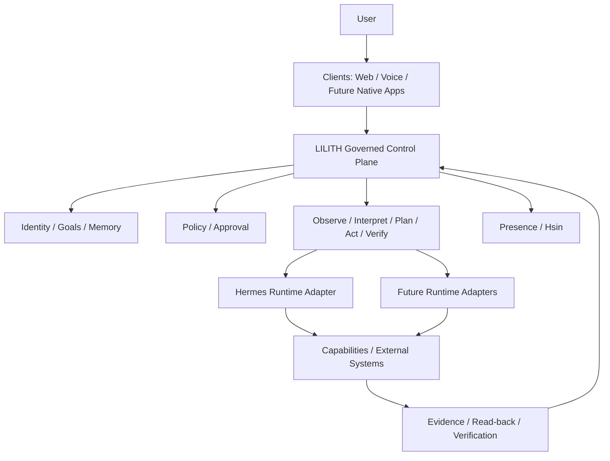

# LILITH

> A persistent, embodied, governed personal AI operating system designed to maintain identity, memory, goals, authority, and continuity across replaceable models, runtimes, tools, devices, and interfaces.

LILITH is a long-term engineering and research project exploring what it takes to build a personal AI system that remains coherent, accountable, verifiable, and useful over time.

It is not defined by a single language model, runtime, database, interface, or cloud provider.

## LILITH and Hermes

The central architectural distinction is:

```text
LILITH                                         Hermes
──────────────────────────────────────         ───────────────────────────
Persistent identity and continuity             Runtime/execution substrate
Memory and long-running goals                  Model and tool orchestration
Governance and delegated authority             Replaceable capability host
Canonical state and provenance                 Execution environment
Verification and evidence
Cross-device continuity
Embodiment through Hsin
```

Hermes provides execution and agency infrastructure. Hermes is not LILITH.

LILITH owns the persistent identity, cognition, governance, memory, goals, evidence, continuity, and relationship with the user.

> Hermes answers: “How can this execute?”
>
> LILITH answers: “Should it execute, under whose authority, with what context, how do we verify the result, and how does the same intelligence continue afterward?”

The runtime is replaceable. The identity is not.

---

## Current system

LILITH already contains working foundations across several areas:

- Next.js-based LILITH OS interface
- Command and task lifecycle
- Persistent task state
- Cognitive architecture developed through multiple implementation slices
- World modelling
- Reasoning and goal-executive foundations
- Planning and replanning architecture
- Social and ethical cognition foundations
- Learning consolidation
- Canonical long-term memory architecture
- Backend services deployed on GCP
- Hermes integration
- Voice and text interaction
- Embodied visual presence through Hsin
- Hsin expression, gaze, blinking, lip-sync, speaking, and ambient motion systems

The project is currently entering an architecture-review and engineering-foundation phase before expanding further autonomy.

The immediate focus is on:

- Consolidating source control
- Formalizing architecture and component boundaries
- CI/CD
- Security and threat modelling
- Memory and state governance
- Evaluation
- Observability
- Safe autonomy
- Deployment and rollback discipline

---

## Architectural north star



## Core principles

- **Identity above infrastructure**
  Models, runtimes, clients, databases, and cloud platforms are replaceable.

- **Governance cannot be bypassed**
  Capabilities must be explicit, scoped, risk-aware, and policy checked.

- **Execution is not success**
  A successful API call does not automatically mean the user's goal succeeded.

- **Evidence before claims**
  Important outcomes should be supported by verification and provenance.

- **State has authority**
  Live, cached, stale, inferred, simulated, and user-entered information must not be silently conflated.

- **Autonomy is graduated**
  New capabilities move through design, simulation, shadow mode, approval gating, testing, and measured release.

- **Embodiment does not own cognition**
  Hsin expresses semantic state but does not define LILITH's reasoning.

- **Production is a deployment target, not a development environment**
  Source control and CI/CD become the authority for production changes.

---

## Repository structure

The repository is evolving toward a full LILITH monorepo.

Current and planned areas include:

```text
lilith-os/
├── src/                     Current LILITH web application
├── public/                  Assets including embodiment resources
├── docs/
│   ├── architecture/        Architecture and cognitive slices
│   ├── adr/                 Architecture Decision Records
│   ├── engineering/         Development, testing, and CI/CD
│   ├── journal/             Engineering-learning records
│   ├── research/            Research questions and experiments
│   ├── roadmap/             Delivery and maturity roadmap
│   └── security/            Threat model and trust boundaries
├── scripts/                 Repository and engineering utilities
├── .github/                 GitHub workflows and contribution templates
└── ...
```

As backend source is consolidated into the repository, the structure will expand toward dedicated application, service, infrastructure, database, and shared-contract boundaries.

---

## Hsin

Hsin is the embodied visual presence of LILITH.

Hsin is not a separate AI and does not own cognition.

The Cognitive Core emits semantic presence states such as:

```text
LISTENING
THINKING
PLANNING
WORKING
WAITING_FOR_APPROVAL
VERIFYING
SUCCESS
PARTIAL_SUCCESS
FAILURE
UNCERTAIN
ALERT
PLAYFUL
SERIOUS
```

The Presence system translates these states into visual behaviour such as posture, gaze, expression, movement, breathing, ears, tail, orientation, and animation.

This keeps cognition independent from any particular embodiment renderer.

---

## Documentation

Start here:

- [Documentation Index](docs/README.md)
- [Architecture Overview](docs/architecture/README.md)
- [Architectural Principles](docs/architecture/principles.md)
- [Current-State Architecture](docs/architecture/as-is.md)
- [Target Architecture](docs/architecture/target.md)
- [Research Register](docs/research/research-question-register.md)
- [Architecture Decision Records](docs/adr/README.md)
- [Engineering](docs/engineering/development.md)
- [Threat Model](docs/security/threat-model.md)
- [Roadmap](docs/roadmap/roadmap.md)

---

## Research direction

The overarching research question is:

> **How can a persistent personal AI become increasingly capable and autonomous over years while preserving identity continuity, truthfulness, user authority, privacy, safety, explainability, and trust?**

LILITH treats architecture questions as research problems where appropriate.

The project follows:

```text
Learn
  ↓
Apply
  ↓
Experiment
  ↓
Verify
  ↓
Document
  ↓
Publish
```

---

## Development

The current frontend is based on Next.js.

For local development:

```bash
npm install
npm run dev
```

The application is normally available at [http://localhost:3000](http://localhost:3000).

Backend connectivity should use the environment variables documented in [`.env.example`](.env.example).

Real credentials and local environment files must never be committed.

---

## Security

LILITH is experimental and increasingly capable.

Security architecture is based on:

- Least privilege
- Explicit authority
- Approval-bound consequential actions
- Capability isolation
- Evidence and read-back verification
- Provenance
- Credential isolation
- Prompt-injection resistance
- Memory-poisoning resistance
- Auditable execution

See [SECURITY.md](SECURITY.md) and the [Threat Model](docs/security/threat-model.md).

---

## Project status

LILITH is under active development.

The current phase focuses on consolidating the existing implementation into a stronger engineering foundation before continuing higher-autonomy development.

That includes architecture review, source-control normalization, CI/CD, evaluation, security, observability, deployment discipline, and documentation.

---

## License

No open-source license has been selected yet.

Until a license is explicitly added, all rights are reserved.

---

LILITH is not being built as another chatbot. It is being built as a persistent personal intelligence with one identity across time, devices, runtimes, capabilities, and embodiment.
