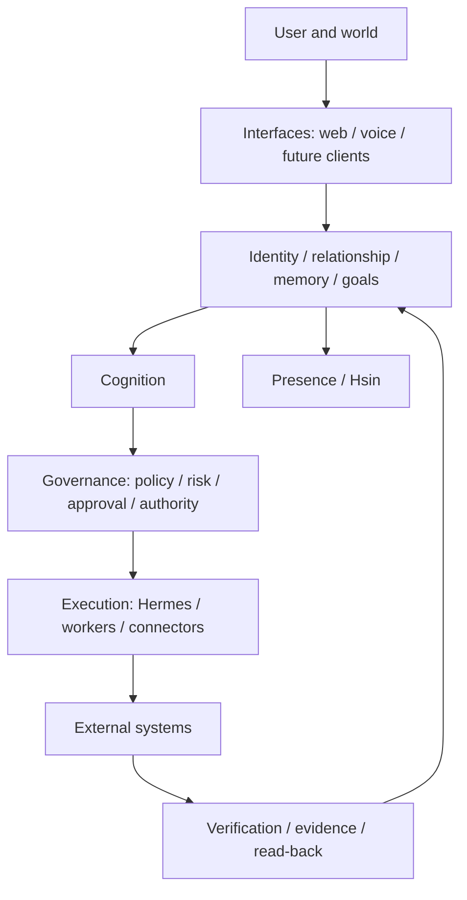

# LILITH

> A persistent, embodied, governed personal AI operating system designed to maintain identity, memory, goals, authority, and continuity across replaceable models, runtimes, tools, devices, and interfaces.

LILITH is a long-term engineering and research project exploring what it takes to build a personal AI system that remains coherent, accountable, verifiable, and useful over time.

It is not defined by a single language model, runtime, database, interface, embodiment, or cloud provider.

## LILITH and Hermes

The central architectural distinction is:

```text
LILITH                                         Hermes
--------------------------------------         ---------------------------
Persistent identity and continuity             Runtime/execution substrate
Memory and long-running goals                  Model and tool orchestration
Governance and delegated authority             Replaceable capability host
Canonical state and provenance                 Execution environment
Verification and evidence
Cross-device continuity
Embodiment through Hsin
```

Hermes provides execution and agency infrastructure. Hermes is not LILITH.

LILITH owns the persistent identity, cognition, governance, memory, goals, evidence, continuity, and relationship with the user.

> Hermes answers: "How can this execute?"
>
> LILITH answers: "Should it execute, under whose authority, with what context, how do we verify the result, and how does the same intelligence continue afterward?"

The runtime is replaceable. The identity is not.

```text
LILITH != model
LILITH != Hermes
LILITH != Hsin
LILITH != UI
LILITH != cloud

LILITH = governed continuity across replaceable machinery.
```

## How to read project claims

LILITH separates present evidence from intended architecture and open research.

| Label | Meaning |
| --- | --- |
| **AS-IS** | Implemented or operationally evidenced in the current project record. A foundation is not necessarily mature end to end. |
| **PARTIAL** | A real foundation exists, but activation, coverage, evaluation, or integration remains incomplete. |
| **TARGET** | An intentional design direction. It is not a claim that the capability is live. |
| **RESEARCH** | An unresolved question, hypothesis, or experiment requiring evidence. |
| **HISTORICAL** | A preserved earlier architecture, roadmap, or implementation checkpoint that may have evolved or been superseded. |

These labels apply throughout the public documentation. Dates and diagrams do not promote a TARGET or RESEARCH item to AS-IS.

## Current status

### AS-IS

- A Next.js LILITH OS application and a backend Core API under `services/core-api`.
- A persistent command and task lifecycle with backend task records, policy probes, connectors, verification paths, and tests.
- Implemented foundations for the world model, goal/executive system, reasoning, global workspace, motivation, planning and replanning, ethical deliberation, social/presence behavior, and learning/consolidation. Maturity varies by slice.
- Canonical-memory groundwork, including guarded authority, privacy, containment, and provenance boundaries. Production memory apply remains disabled.
- Hermes integration for model and tool execution.
- Voice and text interaction foundations.
- Hsin assets and presence foundations, including gaze, ambient motion, expression, lip-sync, and semantic presence states.
- GitHub source control, protected `main`, pull-request CI, exact-SHA deployment to isolated DEV, health verification, Core API deployment to private PROD, and tested source rollback behavior.

### PARTIAL

- The command, task, policy, connector, and verification loop is implemented in bounded paths, not as a universal autonomous executor.
- Cognitive layers exist as implementation slices and responsibility boundaries; they are not all equally mature or independent services.
- Canonical long-term memory has guarded foundations, but full autobiographical admission, retrieval, consolidation, contradiction handling, correction, deletion, and production activation are not complete.
- Long-horizon goals, resumable work, replanning, and reconciliation have foundations but are not complete across all failure modes.
- Voice and Hsin provide an embodied interaction layer, while mature turn-taking, cross-device presence, and broader embodiment remain incomplete.

### TARGET

- Governed autobiographical memory with lineage, correction, deletion, decay, consolidation, and privacy-aware retrieval.
- Long-horizon autonomy earned through simulation, shadow mode, approval gating, evaluation, and measured release.
- One-identity continuity across devices with conflict resolution and device-specific execution.
- A broader ecosystem of least-privileged workers, runtime adapters, and connectors.
- Richer Hsin embodiment and honest semantic expression across interfaces and devices.
- Production-grade observability, revision reporting, restore-tested recovery, immutable artifact promotion, infrastructure as code, and frontend hosting.

### RESEARCH

- Functional affect and relationship continuity without manipulation, dependency shaping, or unsupported claims of subjective experience.
- Memory economics, contradiction management, adversarial-memory defense, counterfactual reasoning, and safe offline consolidation.
- Delegated authority, multi-worker disagreement, long-running task recovery, cross-device identity, and calibrated autonomy.
- Evaluation methods for identity continuity, truthfulness, safety, usefulness, and trust over long time horizons.

### HISTORICAL

Earlier product and architecture work - including the app framework, universal timeline, event fabric, attention levels, Career CRM, privacy zones, local/cloud deployment concepts, visual shell, and prior roadmap checkpoints - remains valuable project history. Historical material should be read through its stated date and status, not as a claim about the current deployment.

## Architecture at a glance




The governing lifecycle is:

```text
Cognition proposes
  -> Governance authorizes
  -> Runtime executes
  -> Verification proves
  -> Canonical owners update state
```

Execution is not proof of success. An API response, tool output, or model statement is evidence to evaluate, not permission to assert that the user's goal was achieved.

### Ownership boundaries

- **Identity, relationship, memory, and goals** carry durable continuity and authoritative personal state.
- **Cognition** interprets, reasons, plans, replans, and proposes actions using bounded context.
- **Governance** evaluates policy, risk, delegated authority, approval, expiry, and revocation.
- **Hermes, workers, and connectors** execute scoped capabilities. They do not own identity, durable authority, or final truth.
- **Verification** independently reads back consequential results, classifies outcomes, and records evidence.
- **Presence and Hsin** translate semantic state into voice, expression, gaze, posture, and motion. Hsin does not own cognition, memory, policy, or action authority.

## Architectural principles

- **Identity above infrastructure.** Models, runtimes, clients, storage implementations, and cloud platforms are replaceable.
- **One authoritative owner per invariant.** Projections, caches, and adapters do not gain authority by sharing storage or context.
- **Governance cannot be bypassed.** Capabilities must be explicit, scoped, risk-aware, policy-checked, and bound to the authorized proposal.
- **Execution is not success.** Consequential outcomes require evidence and, where justified, independent read-back.
- **State has authority and provenance.** Live, cached, stale, inferred, simulated, and user-entered information must not be silently conflated.
- **Autonomy is graduated.** Capabilities progress through design, simulation, shadow mode, approval gating, testing, and measured release.
- **Embodiment does not own cognition.** Hsin expresses semantic state without becoming an alternate control plane.
- **Production is a deployment target.** Git and the governed delivery pipeline are the authority for production changes.

## Hsin

Hsin is the embodied visual and voice presence of LILITH. It is not a separate AI.

The cognitive core can emit semantic presence states such as:

```text
LISTENING
THINKING
PLANNING
WORKING
WAITING_FOR_APPROVAL
VERIFYING
SUCCESS
PARTIAL_SUCCESS
FAILURE
UNCERTAIN
ALERT
PLAYFUL
SERIOUS
```

The presence layer translates these states into presentation behavior such as voice, expression, posture, gaze, breathing, orientation, ears, tail, and motion. It must communicate uncertainty and limitations honestly and must not expose private reasoning or confer action authority.

## Repository structure

The repository contains the current application, Core API, public architecture and research material, validation tools, and delivery workflows.

```text
lilith-os/
|-- src/                     LILITH web application
|-- public/                  Assets, including embodiment resources
|-- services/
|   `-- core-api/            Backend Core API
|-- docs/
|   |-- architecture/        Architecture and cognitive slices
|   |-- adr/                 Architecture Decision Records
|   |-- engineering/         Development, testing, and CI/CD
|   |-- journal/             Engineering-learning records
|   |-- research/            Research questions and experiments
|   |-- roadmap/             Delivery and maturity roadmap
|   `-- security/            Threat model and trust boundaries
|-- scripts/                 Repository, validation, and deployment utilities
|-- .github/                 Workflows and contribution templates
`-- ...
```

## Development and delivery

For local frontend development:

```bash
npm install
npm run dev
```

The application is normally available at [http://localhost:3000](http://localhost:3000). Backend connectivity should use the environment variables documented in [`.env.example`](.env.example). Never commit credentials or local environment files.

Production changes follow one enforced path:

```text
feature branch
  -> pull request
  -> repository CI
  -> exact candidate SHA deployed to isolated DEV
  -> service and /health verification
  -> required DEV status
  -> merge to protected main
  -> Core API deployment to PROD when relevant paths change
  -> production verification or rollback
```

The four required checks are:

1. `Repository contracts`
2. `Frontend build and command core`
3. `Core API tests`
4. `LILITH DEV deployment`

The branch must be up to date before merge. Force pushes are blocked, and there is no supported path for direct edits on `main` or on DEV/PROD hosts.

Current production deployment covers the backend/Core API only. The repository contains a substantial frontend, but a production frontend hosting target and production delivery pipeline have not yet been established.

See [CONTRIBUTING.md](CONTRIBUTING.md) and [Development Notes](docs/engineering/development.md) for contribution and validation expectations.

## Documentation

Start here:

- [Documentation Index](docs/README.md)
- [Architecture Overview](docs/architecture/README.md)
- [Architectural Principles](docs/architecture/principles.md)
- [Current-State Architecture](docs/architecture/as-is.md)
- [Target Architecture](docs/architecture/target.md)
- [Research Register](docs/research/research-question-register.md)
- [Architecture Decision Records](docs/adr/README.md)
- [Engineering](docs/engineering/development.md)
- [Threat Model](docs/security/threat-model.md)
- [Roadmap](docs/roadmap/roadmap.md)

The public documentation is a curated entry point. The complete recovery register and canonical research record remain deeper references rather than being reproduced in this README.

## Research north star

> **How can a persistent personal AI become increasingly capable and autonomous over years while preserving identity continuity, truthfulness, user authority, privacy, safety, explainability, and trust?**

LILITH treats architecture questions as research problems where evidence is incomplete. It does not claim novel scientific results, machine consciousness, subjective experience, or solved AI welfare. Functional internal state may be designed and evaluated by its causal behavior; stronger claims require independent scientific evidence.

The project follows:

```text
Learn
  -> Apply
  -> Experiment
  -> Verify
  -> Document
  -> Publish
```

## Security

LILITH is experimental and increasingly capable. It is not a supported general-purpose production release and is not represented as safe for sensitive, irreversible, financial, or safety-critical actions.

Security architecture emphasizes least privilege, explicit authority, approval-bound consequential actions, replay protection, idempotency, capability isolation, provenance, independent verification, credential isolation, prompt-injection resistance, memory-poisoning resistance, and auditable execution.

See [SECURITY.md](SECURITY.md) and the [Threat Model](docs/security/threat-model.md).

## License

No open-source license has been selected.

Unless and until a license is explicitly added, all rights are reserved.

---

LILITH is not being built as another chatbot. It is being built as a persistent personal intelligence with one governed identity across time, devices, runtimes, capabilities, and embodiment.
