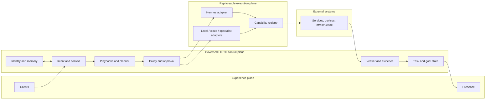

# Architecture Overview

LILITH is designed as a persistent governed system above replaceable execution substrates. The architecture separates identity and authority from model execution so
that changing Hermes, a model provider, a client, or a database does not silently create a different system or bypass policy.

## High-level architecture


## Architecture document hierarchy

| Document | Question answered |
| --- | --- |
| [Principles](principles.md) | What must remain true as the system evolves? |
| [System Context](system-context.md) | Who and what interacts with LILITH? |
| [AS-IS](as-is.md) | What is supported by current repository evidence? |
| [Target Architecture](target.md) | What architecture are we moving toward? |
| [Component Boundaries](component-boundaries.md) | What does each major part own and forbid? |
| [State and Data](state-and-data.md) | Where does durable truth live and how does it evolve? |
| [Runtime Boundary](runtime-boundary.md) | How do Hermes and future runtimes serve LILITH? |
| [Trust Boundaries](../security/trust-boundaries.md) | Where does data or authority cross into a less-trusted context? |

## Logical planes



The diagram is a target logical model, not proof of deployed components.

## Agent control loop

```text
Observe → Interpret → Plan → Policy/Approval → Act → Read back → Verify → Update state
```

The loop has explicit stop states: denied, cancelled, timed out, blocked, unknown execution state, verification failed, and partial success. “API returned success” does not automatically transition a task to completed.

## Cross-cutting authorities

Some responsibilities must apply across all execution paths:

- identity and relationship continuity;
- policy and authorization;
- canonical state and synchronization;
- provenance and evidence;
- observability and audit;
- secrets and credential isolation;
- attention and interruption policy.

No runtime, worker, plugin, or UI path may bypass them merely because it is convenient.

## Evolution rule

Keep the architecture as small as the responsibilities allow. A layer should exist only when it owns a real invariant, trust boundary, state boundary, or failure boundary. If removing a layer loses no such responsibility, merge or remove it.
