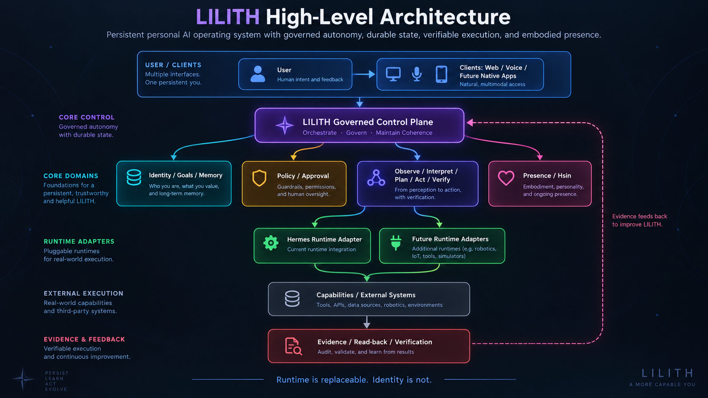
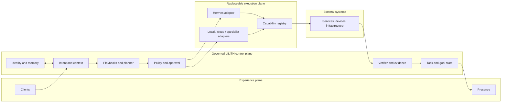

# Architecture Overview

LILITH is designed as a persistent governed system above replaceable execution substrates. The architecture separates identity and authority from model execution so
that changing Hermes, a model provider, a client, or a database does not silently create a different system or bypass policy.

## High-level architecture



## Architecture document hierarchy

| Document | Question answered |
| --- | --- |
| [Principles](principles.md) | What must remain true as the system evolves? |
| [System Context](system-context.md) | Who and what interacts with LILITH? |
| [AS-IS](as-is.md) | What is supported by current repository evidence? |
| [Target Architecture](target.md) | What architecture are we moving toward? |
| [Component Boundaries](component-boundaries.md) | What does each major part own and forbid? |
| [State and Data](state-and-data.md) | Where does durable truth live and how does it evolve? |
| [Runtime Boundary](runtime-boundary.md) | How do Hermes and future runtimes serve LILITH? |
| [Trust Boundaries](../security/trust-boundaries.md) | Where does data or authority cross into a less-trusted context? |
| [Slice 15B2b-A Canonical Runtime Foundation](slice-15b2b-a-canonical-runtime-foundation.md) | How are V2 proposals migrated, applied, packaged, and kept production-dark? |
| [Slice 15B2b-A Acceptance Record](slice-15b2b-a-acceptance-record.md) | What was accepted in source, proven in isolated DEV, and observed dark in PROD? |
| [Slice 15B2b-B1a Owner-Proof Contracts](slice-15b2b-b1a-owner-proof-contracts.md) | What synthetic WebAuthn proof is verified, and why is it not yet owner authority? |
| [Slice 15B2b-B1c Routine DEV Deployer Authority](slice15b2b-b1c-dev-deployer-authority.md) | How is routine DEV deployment cut off from root, broker, activation, Stage III and PROD authority? |
| [Slice 15B2b-B1c Acceptance Record](slice-15b2b-b1c-acceptance-record.md) | What did the real constrained DEV deployment prove, and what authority debt remains open? |
| [Slice 15B2b-B Owner Memory Control Design](slice-15b2b-b-owner-memory-control-design.md) | How can an owner-chosen memory eventually be accepted without the model, runtime, deployment, or a database write becoming authority? (design record) |
| [Slice 15B2b-B2a Accepted-Memory Contract and Verifier](slice-15b2b-b2a-accepted-memory-verifier.md) | What does the TEST-only verifier require before it returns ACCEPTED_MEMORY? (source implemented / test proven; live authority absent) |
| [Slice 15B2b-B1b-3 Authority and Key Custody Isolation Design](slice-15b2b-b1b3-custody-isolation-design.md) | How does authority-signing custody leave the application so that a compromised `lilith`, model, deployer, or DB writer cannot manufacture an accepted authority chain? (design record) |
| [Slice 15B2b-B1b-3a Authority Evidence and Key Registry Contracts](slice-15b2b-b1b3a-authority-registry-contracts.md) | What do the TEST-only registry, Owner/Actor evidence, and Privacy authorization contracts require, and how do retirement, compromise, environment, and epoch fail closed? (source implemented / test proven; live custody absent) |
| [Slice 15B2b-B1b-3b Broker-only Signing and L04 V2 Verification Adapter](slice-15b2b-b1b3b-broker-signing-l04-v2-adapter.md) | How does a TEST-only broker signer mint OwnerEvidenceV2 only after a consumed owner proof, and how does the L04 V2 adapter refuse rows, V1 HMAC evidence, and forged authority? (source implemented / test proven; live signing, live L04 V2 admission, and real custody absent) |

## Logical planes



The diagram is a target logical model, not proof of deployed components.

## Agent control loop

```text
Observe → Interpret → Plan → Policy/Approval → Act → Read back → Verify → Update state
```

The loop has explicit stop states: denied, cancelled, timed out, blocked, unknown execution state, verification failed, and partial success. “API returned success” does not automatically transition a task to completed.

## Cross-cutting authorities

Some responsibilities must apply across all execution paths:

- identity and relationship continuity;
- policy and authorization;
- canonical state and synchronization;
- provenance and evidence;
- observability and audit;
- secrets and credential isolation;
- attention and interruption policy.

No runtime, worker, plugin, or UI path may bypass them merely because it is convenient.

## Evolution rule

Keep the architecture as small as the responsibilities allow. A layer should exist only when it owns a real invariant, trust boundary, state boundary, or failure boundary. If removing a layer loses no such responsibility, merge or remove it.
