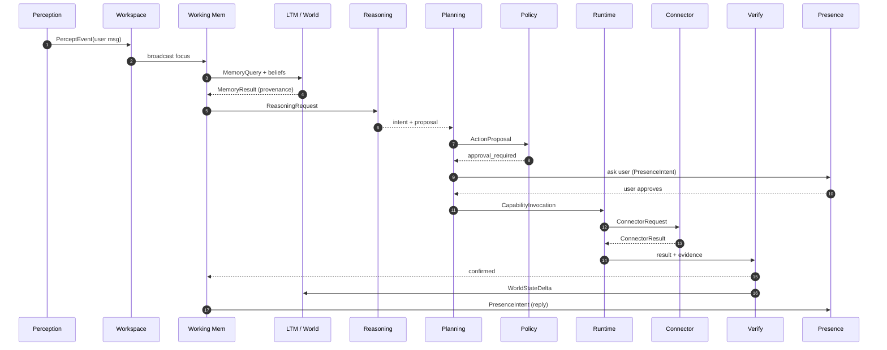
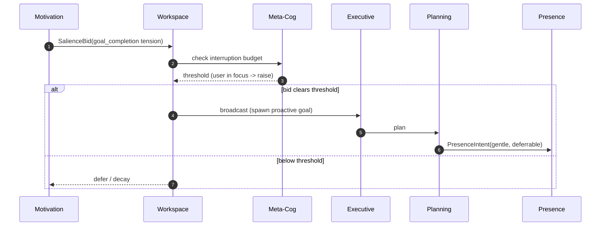
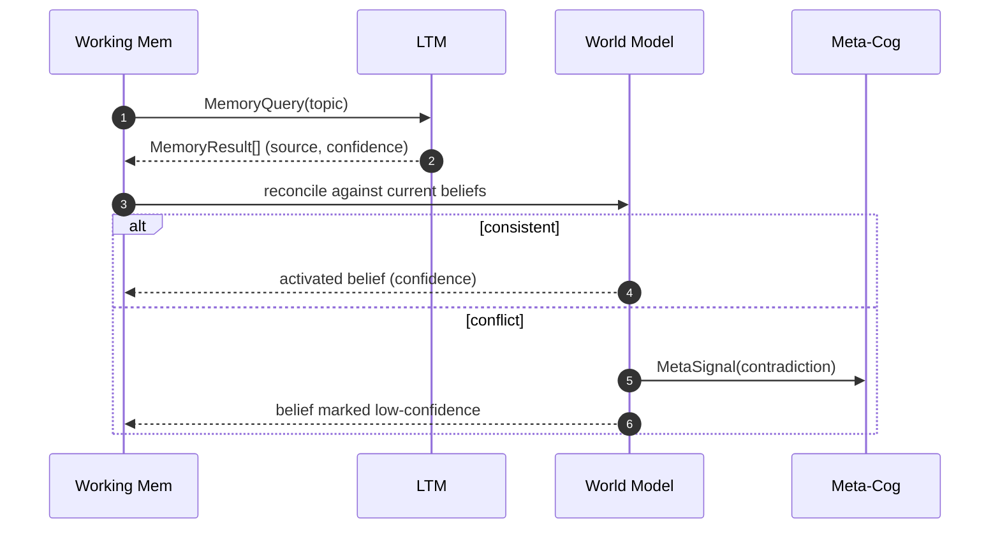
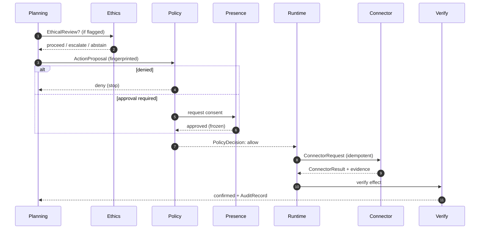
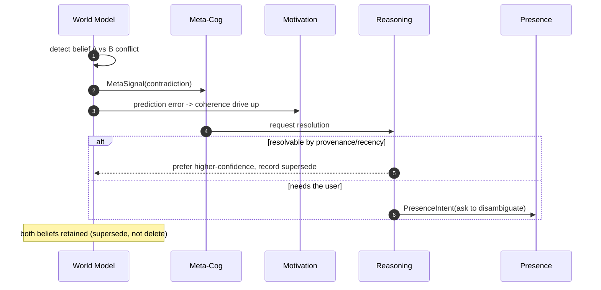
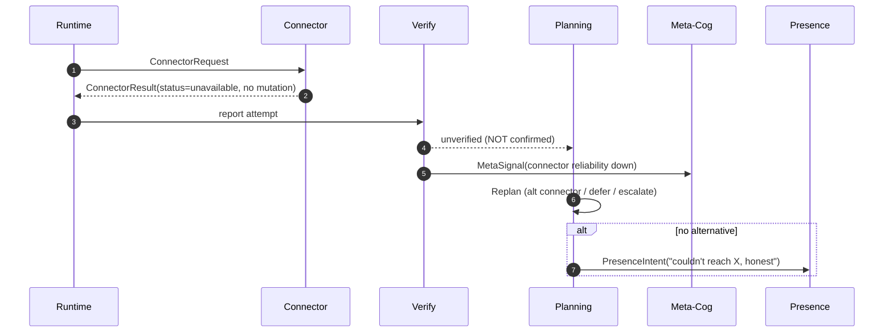

# LILITH Cognitive Architecture V1

> **Status:** Architectural authority for all future cognitive work.
> **Type:** Design specification — no consciousness claims, no AGI machinery.
> **Baseline:** Slices 1–6 complete and live-accepted.
> **Governing rule:** *the planner proposes · policy governs · connectors perform I/O · the verifier proves.*

The LLM is **one reasoning component, not the whole brain.** Every boundary is a typed contract; every cognitive layer is independently replaceable; failures are isolated and observable; policy/safety is authoritative over actions; memory is not automatically truth.

---

## 0. Deployment boundary (read first)

This architecture spans two deployment surfaces, and the split is load-bearing:

- **The private backend VM** (remote FastAPI service, reached only via a localhost SSH/IAP tunnel — `LILITH_API_URL`, server-only) hosts the action spine and safety authorities: the durable stores, `/os/*` API, real-core, policy engine, connector fabric, and the watcher fleet.
- **This repo (LILITH OS frontend, Next.js)** holds the transport seam (a read-only allow-listed GET proxy + the single write channel `POST /os/conversation` → Router V2), the Presence renderer, and the read surfaces.

For design purposes the VM is an **external system exposing an HTTP contract.** Cognitive layers below are the formal names for what that contract implies and for the layers still to be built on top of it.

---

## 1. The full architecture

Nineteen cognitive layers arranged as a signal path from perception to presence, wrapped by four cross-cutting authorities every action must pass through. Data flows **up** into deliberation and **down** into action; nothing skips a tier.

```
CROSS-CUTTING AUTHORITIES  (observe or gate every tier; own no domain reasoning)
  Meta-Cognition · Policy/Trust · Verification · Device/Session Sync

TIER 1  Perception          Perception / Input
TIER 2  Attention           Attention / Global Workspace   ·  Working Memory
TIER 3  Representation       Long-Term Memory (episodic/semantic/procedural)  ·  World Model
TIER 4  Drive & control     Motivational / Homeostatic     ·  Goal / Executive
TIER 5  Deliberation        Reasoning · Ethical Deliberation · Planning/Replanning · Social Cognition/Personality
TIER 6  Action              Policy/Trust (gate) · Capability Runtime · Connector Fabric
TIER 7  Expression          Presence Director  ·  Learning / Consolidation
```

**The governing sentence.** The Planner *proposes*, Policy *governs*, Connectors *perform I/O*, the Verifier *proves*. No single layer holds more than one of those roles — that separation is why the LLM can be swapped, wrong, or offline without the system taking an unsafe action.

---

## 2–7. Layer directory

Each layer is specified by six facets: **responsibility**, **owns**, **does NOT own**, **allowed dependencies / call direction**, **typed contracts**, and **owned state**. A layer may read another layer only through a contract; it may never reach past a boundary or mutate another layer's state. Notation: `A → B` means "A may call B".

### L01 · Perception / Input — *Tier 1*
- **Responsibility:** Turn every heterogeneous inbound signal (chat across adapters, timers, device/presence changes, connector callbacks) into one normalised, typed, provenance-stamped `PerceptEvent`. The only place raw external formats may exist.
- **Owns:** adapter/normalisation per source; dedupe & ordering; source/channel/timestamp/raw-ref stamping; the `PerceptEvent` schema.
- **Does NOT own:** deciding what matters (Workspace); interpreting meaning (Reasoning); memory writes; any outbound action.
- **Depends:** `Perception → Workspace` (emits only).
- **Contracts:** `PerceptEvent`. **State:** adapter connection state, dedupe window. No cognitive state.

### L02 · Attention / Global Workspace — *Tier 2*
- **Responsibility:** Receive salience bids from every source, let them compete for a bounded focus, and *broadcast* the winner so it becomes globally available to memory, reasoning, goals, social cognition and presence. Owns whether something becomes "conscious" this cycle, and controls interruption.
- **Owns:** salience scoring & arbitration; the broadcast bus & current focus; interruption budget & thresholds; inhibition-of-return.
- **Does NOT own:** what a focused item means; whether to act (Executive); how to deliver an interruption (Presence); long-term storage.
- **Depends:** `any layer → Workspace` (bids); `Workspace → Working Memory` (broadcast).
- **Contracts:** `SalienceBid`, `WorkspaceBroadcast`. **State:** bid queue, current focus, interruption budget, refractory set.

### L03 · Working Memory — *Tier 2*
- **Responsibility:** Hold the small, volatile *working set* for the current cognitive episode — broadcast focus plus retrieved memories, active beliefs and live goals assembled into one context. The scratchpad, not the archive.
- **Owns:** the current `WorkingSet` & its lifetime; activation/decay of focused items; context assembly; capacity bounds.
- **Does NOT own:** durable truth (World Model); the archive (LTM); salience (Workspace); cross-device persistence (Sync).
- **Depends:** `WM → LTM`, `WM → World Model` (reads).
- **Contracts:** `WorkingSet`, `MemoryQuery`. **State:** per-episode working set — **ephemeral, capacity-bounded, reconstructible** (see §7a).

### L04 · Long-Term Memory — *Tier 3*
- **Responsibility:** The durable archive of *what was recorded*, across episodic (events), semantic (facts), procedural (skills/recipes), each item carrying full provenance and confidence. Answers retrieval; does not decide current truth.
- **Owns:** the three stores; provenance & confidence per item; retrieval & ranking; redaction/consent on read.
- **Does NOT own:** current truth (memory ≠ truth); what to write (Consolidation decides); belief reconciliation (World Model); any action.
- **Depends:** `callers → LTM` (read); `Consolidation → LTM` is the **only** writer.
- **Contracts:** `MemoryQuery`, `MemoryResult`, `MemoryItem`. **State:** the three memory stores + provenance index.

### L05 · World Model — *Tier 3*
- **Responsibility:** Maintain the current best-estimate *beliefs* about user, devices, external systems, ongoing tasks, environment. Reconcile past (memory) with present (perception/verification) into an explicit, inspectable belief graph; emit prediction error when reality surprises it.
- **Owns:** the belief graph; per-belief confidence/provenance/TTL; conflict detection & recording; prediction-error/novelty.
- **Does NOT own:** the historical record (LTM); the LLM's latent state (explicit only); goals or actions; resolving a conflict by deleting evidence.
- **Depends:** `World Model → LTM` (reads history); updated from Perception + Verification.
- **Contracts:** `Belief`, `WorldStateDelta`, `PredictionError`. **State:** live belief graph — **current-state, durably checkpointable** (see §7a).

### L06 · Motivational / Homeostatic System — *Tier 4*
- **Responsibility:** Compute a vector of *functional drives* from measurable proxies and turn homeostatic error into salience weights biasing attention and goal arbitration. Prioritisation signals — never claims of feeling or suffering.
- **Owns:** drive setpoints/levels/decay; proxy→drive mapping; drive-weighted salience; per-drive caps.
- **Does NOT own:** goals (Executive); any action; emotional display (Presence); simulated distress or reward-for-pain.
- **Depends:** `Motivation → Workspace` (salience), `Motivation → Executive` (weights); reads World Model + Verification metrics.
- **Contracts:** `DriveState`, `DriveSignal`. **State:** drive vector (levels, setpoints, history).

### L07 · Goal / Executive System — *Tier 4*
- **Responsibility:** Own the goal stack — create/prioritise/suspend/resume/retire goals & sub-goals, arbitrating user requests, standing commitments and drive-driven impulses. Decides *what to pursue now*; delegates *how* to Reasoning/Planning.
- **Owns:** goal lifecycle & stack; priority arbitration & preemption; durable task continuity; goal–drive reconciliation.
- **Does NOT own:** producing plans (Planning); inferring intent (Reasoning); executing (Runtime); permission (Policy).
- **Depends:** `Executive → Reasoning`, `Executive → Planning`; reads Workspace focus + drive weights.
- **Contracts:** `Goal`, `GoalDelta`. **State:** durable goal/task store (source of truth for continuity).

### L08 · Reasoning System — *Tier 5*
- **Responsibility:** Perform inference over the working set — interpret intent, answer questions, draw domain conclusions. **The LLM lives here as a component:** a called, bounded, replaceable inference engine whose outputs are proposals/interpretations, never side effects.
- **Owns:** model selection & prompt assembly; inference; confidence estimates; structured interpretation.
- **Does NOT own:** truth (outputs are candidates); deciding to act (Executive/Planning); any tool/I/O; permission (Policy).
- **Depends:** `Reasoning → Working Memory` (reads only); never calls the Action tier.
- **Contracts:** `ReasoningRequest`, `ReasoningResult`. **State:** model routing config; no persistent cognitive state.

### L09 · Ethical Deliberation System — *Tier 5*
- **Responsibility:** Reason about values when the situation is *ambiguous* — where hard policy is silent or permits-but-questionable. Produce an advisory verdict (proceed / seek consent / abstain / escalate) with rationale, uncertainty and consequence estimate. **Distinct from, and subordinate to, Policy.**
- **Owns:** value weighing under ambiguity; consequence/reversibility estimation; reading learned user values as priors; escalation recommendations.
- **Does NOT own:** hard constraints (Policy); power to permit a policy-denied act; executing/blocking directly; storing user values (LTM owns the store).
- **Depends:** `Ethics → LTM` (value priors); `Planning → Ethics` (review request).
- **Contracts:** `EthicalReview`, `ConsequenceEstimate`. **State:** advisory deliberation record (audit). No hard rules.

### L10 · Planning / Replanning — *Tier 5*
- **Responsibility:** Convert a goal into a typed *plan* of steps & action proposals, and replan when a step fails, a connector is unavailable, or verification disproves an assumption. The planner *proposes*; it never performs and never self-grants permission.
- **Owns:** plan structure & ordering; action proposals (typed intents); replan triggers & alternatives; requesting ethical review when flagged.
- **Does NOT own:** permission (Policy); execution (Runtime); I/O (Fabric); proof (Verification).
- **Depends:** `Planning → Ethics`, `Planning → Policy` → hands approved proposals to Capability Runtime.
- **Contracts:** `Plan`, `PlanStep`, `ActionProposal`. **State:** active plans & step status.

### L11 · Social Cognition / Personality — *Tier 5*
- **Responsibility:** Model the relationship and the person (rapport, history, likely mood, delivery preferences) and produce *style directives* colouring how Reasoning phrases output and how Presence embodies it. Personality shapes expression; it never decides or executes.
- **Owns:** persona/voice/norms; relationship model; theory-of-mind; style directives & tone.
- **Does NOT own:** goals/decisions (Executive); tool selection/execution; **any edge to Capability Runtime**; policy or truth.
- **Depends:** `Social → Reasoning` (style), `Social → Presence` (tone); may raise *social_connection* salience only.
- **Contracts:** `StyleDirective`, `RelationalContext`. **State:** persona config + relationship model (provenance-tagged, correctable).

### L12 · Policy / Trust — *Cross-cutting · action gate*
- **Responsibility:** The single authoritative gate on every action proposal — classify, apply hard deontic constraints, return *allow / deny / approval-required* with obligations. Prohibitions are non-negotiable. Nothing reaches a connector without a Policy decision.
- **Owns:** capability classes & prohibition set; allow/deny/approval decisions; approval issuance & expiry; trust levels.
- **Does NOT own:** ethical nuance (Ethics, advisory); executing; deciding what to attempt (Planning); proving outcomes (Verification).
- **Depends:** `Planning/Runtime → Policy`. Policy calls nothing outward — it only returns decisions.
- **Contracts:** `PolicyDecision`, `Approval`. **State:** policy rules, capability registry, active approvals + expiry.

### L13 · Capability Runtime — *Tier 6*
- **Responsibility:** Execute an approved capability — take a policy-cleared proposal, resolve it to a concrete implementation, invoke the right connector, hand the raw result to Verification. The executor: it obeys the gate, it does not re-decide.
- **Owns:** capability implementations/handlers; idempotency & retry; binding proposal→connector; passing results to Verification.
- **Does NOT own:** permission (must hold a `PolicyDecision`); transport (Fabric); deciding success (Verification); choosing what to do (Planning).
- **Depends:** `Runtime → Policy`, `Runtime → Connector Fabric`, `Runtime → Verification`.
- **Contracts:** `CapabilityInvocation`, `CapabilityResult`. **State:** in-flight invocations, idempotency keys.

### L14 · Connector Fabric — *Tier 6*
- **Responsibility:** Perform typed I/O with the outside (and internal) world through discoverable, health-gated connectors. Each declares capabilities, is discovery/health-checked before use; an unsupported/unavailable connector fails closed with **zero mutation.**
- **Owns:** connector registry & discovery; health gating; the typed request/result envelope; connector evidence for audit.
- **Does NOT own:** whether the call is permitted (Policy); what to call (Planning/Runtime); interpreting success beyond transport; cognitive state.
- **Depends:** `Runtime → Fabric`; Fabric calls external systems only.
- **Contracts:** `ConnectorRequest`, `ConnectorResult`, `ConnectorHealth`. **State:** registry, per-connector health & reliability stats.

### L15 · Verification — *Cross-cutting · proof*
- **Responsibility:** Independently prove an intended effect actually happened, using connector evidence and, where possible, an out-of-band check. The **only** layer allowed to declare an action *confirmed*; without its proof, an outcome is "attempted", never "done".
- **Owns:** verification strategy per action class; evidence collection & the audit record; confirmed/unverified verdict; feeding outcomes to World Model & Learning.
- **Does NOT own:** performing the action; permission (Policy); fabricating success; deciding the next plan (Planning).
- **Depends:** `Runtime → Verification`; writes verdicts to World Model, Learning, audit.
- **Contracts:** `VerificationResult`, `AuditRecord`. **State:** durable, append-only audit log.

### L16 · Meta-Cognition — *Cross-cutting · monitor*
- **Responsibility:** Watch the whole system through read-only meta-signals (confidence, latency, contradiction, drive tension, loop detection, budget, persona drift) and intervene only through defined controls: raise salience, request replan, force escalation, throttle. It reflects on cognition; it does not do cognition.
- **Owns:** confidence calibration & anomaly detection; resource/attention budgeting; loop & failure-mode detection; the end-to-end cognitive trace.
- **Does NOT own:** domain reasoning; any action; overriding Policy; being a "second brain".
- **Depends:** `all layers → Meta` (signals); `Meta → Workspace/Executive` (bounded control only).
- **Contracts:** `MetaSignal`, `MetaControl`. **State:** trace store, calibration model, budget counters.

### L17 · Presence Director — *Tier 7*
- **Responsibility:** Render cognitive state into embodiment — orb behaviour, voice, expression, timing of speech and interruption — from a typed `PresenceIntent`. **No cognition inside it:** it never reasons, decides, or reads memory; it only stages what upstream produced.
- **Owns:** orb/avatar animation & state; voice synthesis & timing; delivery of interruptions (how/when to speak); intent→behaviour mapping.
- **Does NOT own:** what to say (Reasoning/Social); whether to interrupt (Workspace); any reasoning/memory/decision; tool execution.
- **Depends:** `upstream → Presence` via `PresenceIntent` only. Presence calls no cognitive layer.
- **Contracts:** `PresenceIntent`. **State:** render/animation state, playback queue. No cognitive state.

### L18 · Learning / Memory Consolidation — *Tier 7*
- **Responsibility:** Run offline, like sleep — read the episodic buffer, extract semantic facts and successful procedural recipes, decay/prune, resolve contradictions by supersession, update the learned user-value model — every write provenance-stamped and reversible. The **only** writer to Long-Term Memory.
- **Owns:** consolidation jobs & scheduling; episodic→semantic/procedural extraction; decay/pruning/contradiction resolution; reinforcement from verified outcomes.
- **Does NOT own:** runtime beliefs (World Model); any external write/connector call; deciding current truth; learning values without consent.
- **Depends:** `Learning → LTM` (sole writer); reads episodic buffer + Verification outcomes.
- **Contracts:** `ConsolidationJob`, `MemoryWrite`. **State:** job queue, consolidation cursors.

### L19 · Device / Session Synchronization — *Cross-cutting · continuity*
- **Responsibility:** Keep one coherent LILITH identity across devices/sessions — reconcile which durable state is authoritative, resolve concurrent edits, present a single *identity frame*.
- **Owns:** identity frame & session handoff; sync/merge of durable state; cross-device conflict resolution; authoritative-source selection.
- **Does NOT own:** the content of any store (owners keep it); cognition; bypassing Policy on any device; Presence rendering.
- **Depends:** `Sync → durable stores` (LTM, Goals, World Model, Policy approvals) via their contracts only.
- **Contracts:** `IdentityFrame`, `SyncDelta`. **State:** sync log, vector clocks, authoritative-source map.

### Allowed call directions (the only legal edges)

| Direction | Edge | Why |
|---|---|---|
| Up (sense) | `Perception → Workspace → Working Memory` | Input becomes focus becomes context |
| Up (recall) | `Working Memory → LTM / World Model` | Assemble context; read beliefs & history |
| Bias | `Motivation → Workspace / Executive` | Drives weight attention & goals only |
| Deliberate | `Executive → Reasoning → Planning` | Choose what; infer; propose how |
| Colour | `Social → Reasoning / Presence` | Style shapes phrasing & embodiment |
| Down (act) | `Planning → Ethics → Policy → Runtime → Fabric` | Propose, review, gate, execute, perform |
| Prove | `Runtime → Verification → World Model / Learning` | Confirm effect, update beliefs, record |
| Express | `upstream → Presence` | PresenceIntent in, embodiment out |
| Reflect | `all → Meta → Workspace / Executive` | Monitor everywhere; intervene narrowly |

Anything not listed is a boundary violation and should fail design review.

---

## 7a. State durability (clarification — supersedes any looser earlier wording)

There are three distinct persistence regimes. The earlier phrasing "no durable writes during online cognition" was ambiguous and is corrected here:

- **World Model** — current-state, **MAY be durably checkpointed** during online cognition. Persisting the *current belief set* (a checkpoint of "what LILITH believes now") is expected and correct; it is not learning.
- **Working Memory** — **ephemeral and reconstructible.** It is never a durable truth database; at most, minimal reconstruction metadata is persisted so it can be rebuilt from durable sources after a reload.
- **Long-Term Memory** — durable, but written **only** by offline Learning/Consolidation.

> The rule *"no durable writes during online cognition"* applies to **Long-Term Memory learning/consolidation** — it does **not** forbid World Model current-state persistence. World Model checkpointing is current-state; LTM consolidation is historical learning. Different regimes, different rules.

---

## 8. Event & data flows

### A · Normal user command


### B · Proactive event


### C · Memory retrieval (memory is a candidate, not truth)


### D · Real-world action (the canonical safety pipeline — Slices 4–6 generalised)


### E · Uncertain / conflicting information (recorded, never silently overwritten)


### F · Connector failure (isolated at the boundary; no fabricated success)


---

## 9. Global Workspace model

Every source submits a `SalienceBid`. Salience is computed, bounded, decaying and explainable — never a raw LLM whim:

```
salience = w1·urgency          # time pressure of the item
         + w2·drive_weight      # from Motivational system
         + w3·goal_relevance    # from Executive (active goals)
         + w4·novelty           # prediction error from World Model
         + w5·policy_risk        # risky items surface for scrutiny
         − decay(age) − inhibition(recently_focused)
```

The workspace selects the top-k bids per cycle (winner-take-most). The winner is written to Working Memory and **broadcast** — LTM can be cued by it, Reasoning can operate on it, the Executive can spin a goal from it, Social can react, Presence can reflect it — all reading one shared focus. This single-broadcast rule keeps layers coherent without coupling.

**Interruption control:** a dynamic, focus-aware threshold (rises when the user is in flow, falls when idle) plus inhibition-of-return (anti-starvation). **Division of labour:** the Workspace decides *whether* something becomes conscious; the Presence Director decides *how and when* to deliver it. Neither owns both.

---

## 10. Motivational / Homeostatic model

Eight computational drives, each a homeostatic error signal (`error = setpoint − level`, capped & decaying) derived from a measurable proxy:

| Drive | Proxy |
|---|---|
| Competence | recent task-success & verification-pass rate |
| Coherence | unresolved World-Model contradiction count |
| Curiosity | novelty / prediction error & known knowledge gaps |
| Goal completion | aging of open high-priority goals |
| Safety | outstanding unverified actions & policy-risk exposure |
| Trust | user approval/rejection ratio, connector reliability |
| Social connection | interaction recency & quality |
| Self-consistency | persona/value contradictions flagged by Meta-Cognition |

**Hard invariant — no simulated suffering.** Drives are error signals *used for prioritisation*, bounded and decaying. The system never represents, rewards, or reports subjective pain, and no drive may be maximised by inducing its own deficit. High error means "attend to this," not "LILITH is suffering." The drive vector is read by **two layers only:** the Workspace (salience weight) and the Executive (goal tie-breaking). Motivation never touches goals, plans, or actions.

---

## 11. Ethical deliberation model

Four separated concerns, deliberately not fused into one "ethics engine":

| Concern | Where | Nature | Can it permit an action? |
|---|---|---|---|
| Hard policy constraints | Policy/Trust (L12) | Deontic, fast, non-negotiable | **Yes** — authoritative gate |
| Ethical reasoning under ambiguity | Ethical Deliberation (L09) | Advisory, deliberative | No — can only restrain/escalate |
| Learned user values/preferences | LTM (semantic) → Ethics reads | Priors, versioned, correctable | No — inputs, never rules |
| Uncertainty & consequence estimation | Ethical Deliberation (L09) | Estimative, scales scrutiny | No — sets how hard to look |

```
action_proceeds = policy.decision == ALLOW
                AND ethics.verdict != ABSTAIN
                AND (ethics.verdict != ESCALATE OR human.consented)
# Policy is necessary. Ethics can subtract, never add.
# A policy DENY ends it regardless of any ethical argument.
```

Consequence estimation drives scrutiny: high-consequence + low-confidence → escalate to the human even when policy permits. Ethics writes an advisory record for every non-trivial action — two independent judgments, both visible in the trace.

---

## 12. Memory taxonomy & provenance

Three memory types — **episodic** (what happened), **semantic** (what is known), **procedural** (how to do things) — one provenance model, one governing principle: **memory is not automatically truth.**

```
MemoryItem = {
  value
  kind:          "episodic" | "semantic" | "procedural"
  source                          # which adapter / connector / user turn
  derivation:    "observed" | "told" | "inferred" | "consolidated"
  confidence     # 0..1
  created_at
  last_verified?                  # null = never independently checked
  corroboration[]                 # supporting items
  supersedes?                     # conflict = supersede, never delete
  consent:       "granted" | "inferred" | "restricted"
}
```

A retrieved item is a **candidate belief.** It becomes *acted-upon* only after the World Model reconciles it, and *confirmed* only after Verification. Contradictions are preserved by supersession, so the history of what LILITH believed — and why it changed — is always reconstructable.

---

## 13. World Model representation

An explicit, inspectable belief graph — not the LLM's hidden latent state. It answers "what is true right now, as far as we can tell?" by reconciling past (memory) with present (perception/verification).

```
Belief = {
  entity          # user, device, task, connector, world-fact
  attribute
  value
  confidence
  provenance[]    # memory items / percepts backing it
  updated_at
  ttl?            # beliefs go stale; some expire
  conflicts[]     # competing beliefs, retained not erased
}
```

**Distinct from LTM:** LTM owns "what we recorded" (durable, historical); the World Model owns "what we believe now" (live, reconciled, expiring, checkpointable). The same fact can sit in both with different confidence, and the World Model may disbelieve a memory it has newer evidence against. When perception contradicts a belief, the surprise becomes a novelty/curiosity signal to Motivation and a contradiction signal to Meta-Cognition.

---

## 14. Meta-cognition model

The reflective monitor. Reads telemetry from every layer (**MetaSignals:** confidence & calibration, latency, contradiction rate, drive tension, reasoning loops, budget usage, persona drift, hallucination-risk heuristics) and intervenes through a few narrow levers (**MetaControls:** raise salience, request replan, force escalation, throttle a loop, tighten the interruption threshold). Nothing else.

Its most valuable product is the **cognitive trace:** a correlation-id-linked reconstruction of one decision end-to-end — which percept won attention, which memories were retrieved at what confidence, what reasoning proposed, what ethics and policy said, what executed, whether verification confirmed it. That trace is what makes the architecture debuggable.

**Not a second brain.** Meta-Cognition is forbidden from domain reasoning and the action tier. It can only *ask* the responsible layer to act; it can never substitute its own judgment or override Policy.

---

## 15. Personality / social-cognition boundary

Personality is real and consistent — and completely walled off from the action path.

- **MAY:** set tone/voice; produce `StyleDirective`s used by Reasoning (phrasing) and Presence (embodiment); maintain the relationship model; raise the *social_connection* drive.
- **MUST NOT:** choose goals, select tools, invoke connectors, make policy decisions, or hold any edge into the Capability Runtime.

Between "the charming layer" and "the acting layer" sits a clean seam: Social Cognition emits `StyleDirective` + `RelationalContext` upward and `PresenceIntent` downward — that is the full extent of its reach. The charming layer and the acting layer are never the same layer.

---

## 16. Learning & consolidation lifecycle

Deliberate and offline, like sleep — never an uncontrolled live rewrite.

1. **Online (live).** Working Memory and the World Model update freely; the World Model *may checkpoint its current state* (§7a). The episodic buffer accumulates what happened. No **Long-Term Memory** write occurs here.
2. **Consolidation trigger.** An offline/async job runs (idle, scheduled, or buffer-pressure). The only path that writes LTM.
3. **Extract.** Episodic → semantic facts (confidence-tagged); successful plans → reusable procedural recipes.
4. **Reconcile.** Decay stale items, prune noise, resolve contradictions by supersession (never destructive delete).
5. **Reinforce from proof.** Verified successes strengthen procedural memory & raise connector-reliability priors; failures lower them.
6. **Value learning (gated).** Learned user-value updates require consent or remain correctable, tagged *inferred* until confirmed.

**No external writes from learning.** Consolidation writes only to internal memory; it never calls a connector and never feeds itself into an action without the normal propose → policy → verify pipeline.

---

## 17. Failure boundaries & observability

Every layer is a bulkhead with a typed boundary, timeout and defined degraded mode. Failures are isolated, never silently papered over, always reconstructable from the trace.

| Layer | Failure mode | Degraded behaviour (fail safe, not silent) |
|---|---|---|
| Reasoning (LLM) | Down / low-confidence / hallucination | Deterministic fallback + honest refusal; propose nothing risky; Meta flags low confidence |
| Long-Term Memory | Unavailable | Operate on Working Memory only; state "memory unavailable"; block value-laden acts |
| World Model | Conflict / stale | Lower confidence, retain both beliefs, request disambiguation; don't act on stale high-stakes beliefs |
| Connector Fabric | Unavailable / unsupported | Fail closed, zero mutation; Runtime replans, defers, or escalates |
| Verification | Cannot prove effect | Mark "unverified" — never "done"; surface honestly; no reinforcement |
| Policy | Rule engine error | Fail closed — deny by default; nothing reaches a connector |
| Presence | Render / voice failure | Degrade to text; cognition already complete and recorded upstream |

**Observability primitives:** correlation id on every cross-layer message; immutable audit record per action (proposal fingerprint, policy decision, ethical verdict, connector evidence, verification result); the Meta-Cognition cognitive trace; health & drive telemetry; and the invariant that **Verification is the sole authority on "done"** so a failure can never masquerade as completion. Because the LLM is one component, the blast radius of a bad generation is a bad *suggestion* — not a bad *action*.

---

## 18. Where Slices 1–6 already live

### Remote backend VM — the action spine & safety authorities
| Shipped | Maps to | Fit |
|---|---|---|
| Slice 1 — real observation (watcher fleet, `career_events`) | Perception/Input → seeds World Model & episodic memory | clean |
| Slice 2 — domain reasoning (Router V2, Hermes gateway) | Reasoning System | clean |
| Slice 3 — durable Task Store (`/os/tasks`, RemoteTaskStore) | Goal/Executive durable substrate | promote to Goals |
| Slice 4 — approval-gated write (`/os/drafts`, fingerprint, `os_audit_log`) | Action pipeline: draft = frozen ActionProposal; approval = Policy `approval_required`; audit = Verification | canonical flow D |
| Slice 5 — policy engine (5 classes, prohibition, approval-expiry, registry) | Policy/Trust + Capability Runtime registry | clean |
| Slice 6 — integration fabric (typed connectors, discovery/health gate, evidence) | Connector Fabric | clean |
| Memory infra (Hermes markdown + `state.db` FTS, `career_events`) | Long-Term Memory + provenance | provenance already present |

### This repo (frontend) — transport, presence, read surfaces
| In-repo | Maps to | Fit |
|---|---|---|
| Conversation relay (`lib/conversation/*`, `conversation-provider.tsx`, `command-input.tsx` → `POST /os/conversation`) | The UI↔cognition transport (single write channel) | clean seam |
| Read proxy (`api/lilith/[...path]/route.ts`, GET-only allow-list) | Read side of Perception / World / audit surfaces | read-only guard |
| Presence Engine (`presence/bus.ts`, `reducer.ts`, `types.ts`, `presence-engine.tsx`, orb/TTS) | Presence Director | needs typed `PresenceIntent` |
| Memory client (`lib/memory/*` → `/memory/*`, **not yet live**, demo fallback) | Long-Term Memory read API (pre-wired) | backend endpoints pending |

> **Naming trap:** `src/lib/presence/capabilities.ts` is **renderer** capabilities (what the orb can display), **not** the Slice-5 Policy capability model. Same word, different layer.

---

## 19. What needs refactoring later (not now, additive only)

- Make Working Memory and the World Model first-class typed stores (today implicit in core/session state).
- Formalise attention (Global Workspace with bids/broadcast replaces ad-hoc dispatch).
- Extract Reasoning from core orchestration (clean `ReasoningRequest/Result` seam).
- Promote the Task Store to a Goal/Executive layer.
- Introduce Motivation and proactivity.
- Separate Ethical Deliberation from Policy (without weakening the gate).
- Give Presence a typed `PresenceIntent` contract (cognition emits one authoritative intent rather than the app scattering `emitPresenceEvent`).
- Add the consolidation loop.
- Device/session sync last.

**Guardrails on all of it:** no refactor touches the Hsin runtime or Google OAuth, adds an external write, or weakens Policy. Each is additive: a new typed layer over shipped components, behind existing safety gates.

---

## 20. Recommended implementation sequence

Build the **spine before the mind** — the representational substrate first, because every higher cognitive layer reads from it.

| Slice | Layer | Why here |
|---|---|---|
| **7 (next)** | World Model + Working Memory V1 | The missing substrate everything else needs |
| 8 | Goal/Executive V1 | Promote the Task Store to typed goals + arbitration |
| 9 | Reasoning extraction | Clean `ReasoningRequest/Result` seam — LLM as component |
| 10 | Global Workspace + Attention V1 | Salience bids, broadcast, interruption budget |
| 11 | Motivational/Homeostatic V1 | Drive vector from measurable proxies — unlocks proactivity |
| 12 | Planning/Replanning V1 | Typed plans over the existing action pipeline |
| 13 | Ethical Deliberation V1 | Advisory layer distinct from policy |
| 14 | Social Cognition + Presence Director contract | Personality boundary + typed `PresenceIntent` |
| 15 | Learning/Consolidation | Scheduled, reversible memory write-back |
| 16 | Device/Session Sync | One identity frame, once durable stores exist |

---

## ★ Slice 7 — World Model + Working Memory V1 (recommended scope)

The representational substrate the entire cognitive middle stands on, and nothing more.

**In scope:** the `Belief`, `WorldStateDelta`, `WorkingSet`, `MemoryQuery/Result` typed contracts; a durable, checkpointable, provenance-stamped belief store (backend, alongside `/os/tasks` and `/os/drafts`) reconciling Slice-1 observations + Slice-3 tasks + memory reads into current beliefs; Working Memory as the per-session activated subset (ephemeral/reconstructible); conflicts **recorded, not overwritten**; a Meta-Cognition trace on every belief write; a read-only `/os/world` API.

**Out of scope:** motivation, planning, attention, ethics (Slices 8–13); external writes; new connectors; Hsin-runtime or Google-OAuth changes; any weakening of Policy — beliefs are **inputs to reasoning, never a bypass of the gate**; Verification remains the only path to "confirmed."

**Why this and not something flashier:** attention, motivation, and planning all read beliefs and working memory. Building any of them first would mean building against implicit state and refactoring later. Slice 7 is the least glamorous and highest-leverage move — the spine that makes Slices 8–16 additive instead of entangled.

---

*Design only. No production code changes to shipped systems in this document. No consciousness claims.*
*Governing rule: the planner proposes · policy governs · connectors perform · the verifier proves.*
