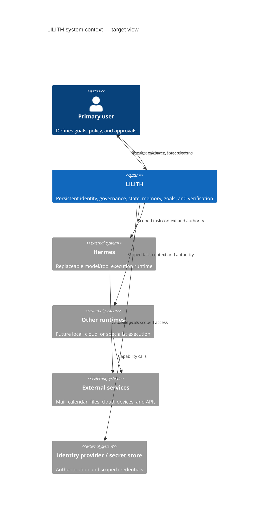

# System Context

## Actors

- **Primary user** — owns the relationship, identity configuration, data permissions, goals, and delegated authority.
- **Maintainer/operator** — develops and operates components but does not automatically receive access to personal content.
- **Contributor/researcher** — proposes code, designs, experiments, or documentation under scoped test data.
- **Adversary** — may control content, tool responses, compromised connectors, a runtime, or an account surface.

## Systems

## In scope

- coherent personal identity across sessions, clients, models, and runtimes;
- durable tasks, goals, relationship state, policy, memory, and provenance;
- bounded planning and capability execution;
- approval, risk, verification, audit, and attention behavior;
- failure recovery, synchronization, and multi-runtime consistency;
- evaluation of technical reliability and human appropriateness.

## Out of scope for the foundation phase

- unrestricted autonomous action;
- production or safety-critical operation;
- claims of human consciousness or personhood;
- storing all conversation by default;
- implementing every layer shown in target diagrams;
- choosing a permanent model, database, cloud, or client stack.

## External assumptions to challenge

- APIs may time out after succeeding.
- connector data may be stale, partial, adversarial, or unavailable.
- users may be asleep, rushed, mistaken, or unavailable.
- models and runtimes will change behavior across versions.
- clocks, networks, credentials, and devices will fail.
- a successful execution response may not mean the user's goal succeeded.
