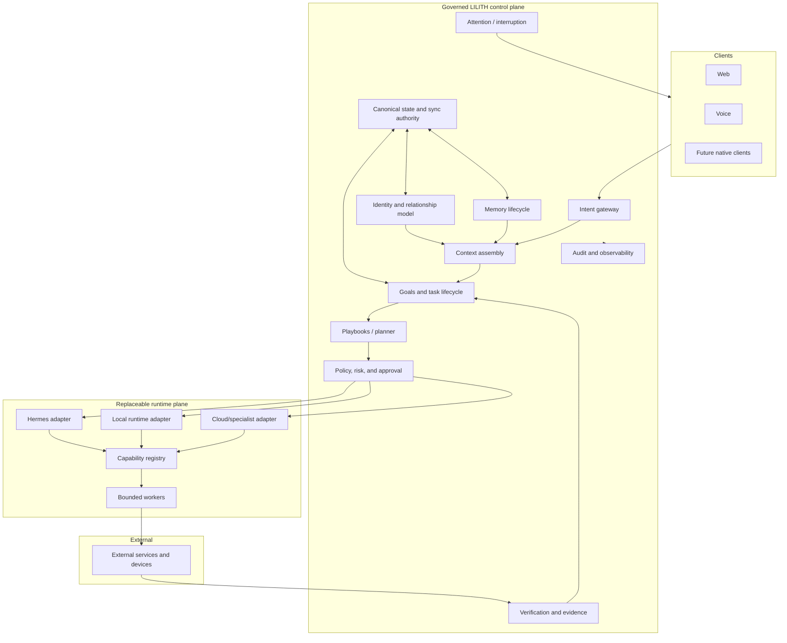
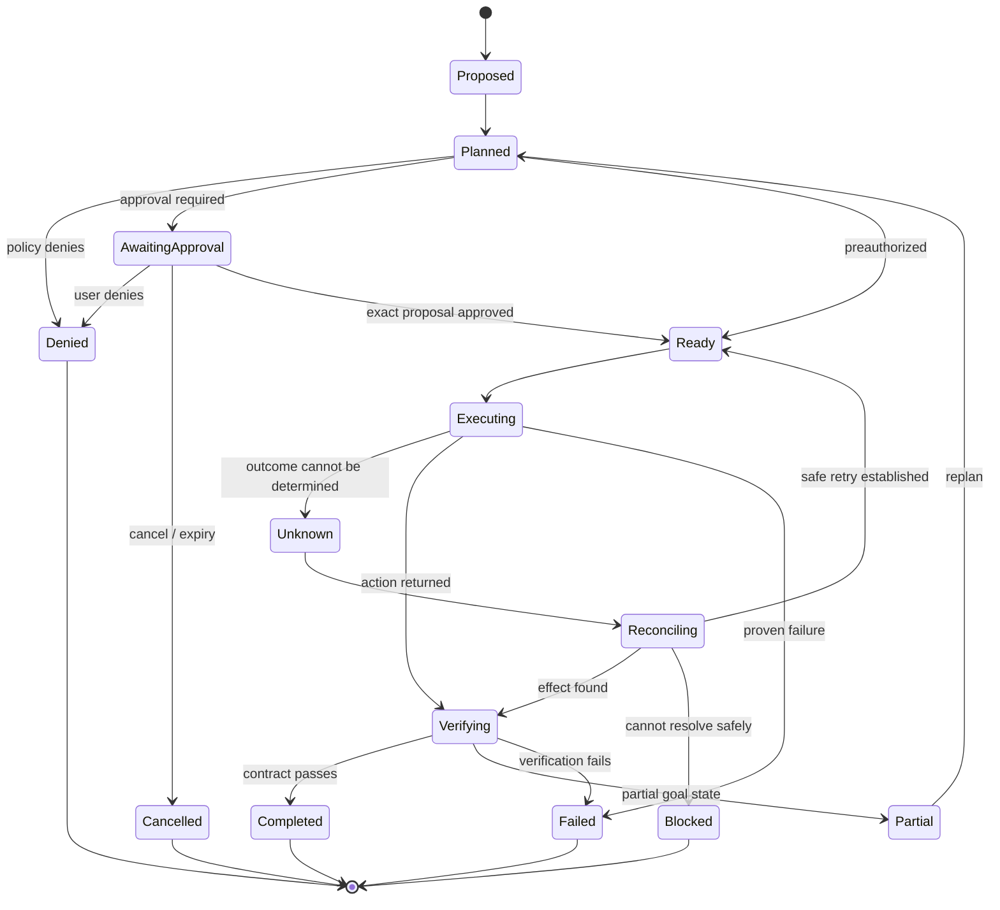

# Target Architecture

This is a directional architecture. Components should be introduced only when a vertical slice demonstrates the responsibility they own.

## Target responsibilities



## Capability contract

Every executable operation should eventually declare:

```text
identity and version
typed input and output
resource and authority scope
intrinsic risk and contextual risk inputs
reversibility and compensating action
credential requirements
preconditions and policy rules
approval and fingerprint requirements
idempotency behavior
timeout, cancellation, and retry semantics
verification contract
evidence and audit schema
data sensitivity and retention
```

## Proposed task lifecycle



## Delivery strategy

Build end-to-end slices through the control loop. Avoid constructing a large speculative hierarchy before one bounded capability proves its contracts. Each autonomy increase requires an evaluation gate and threat-model update.
