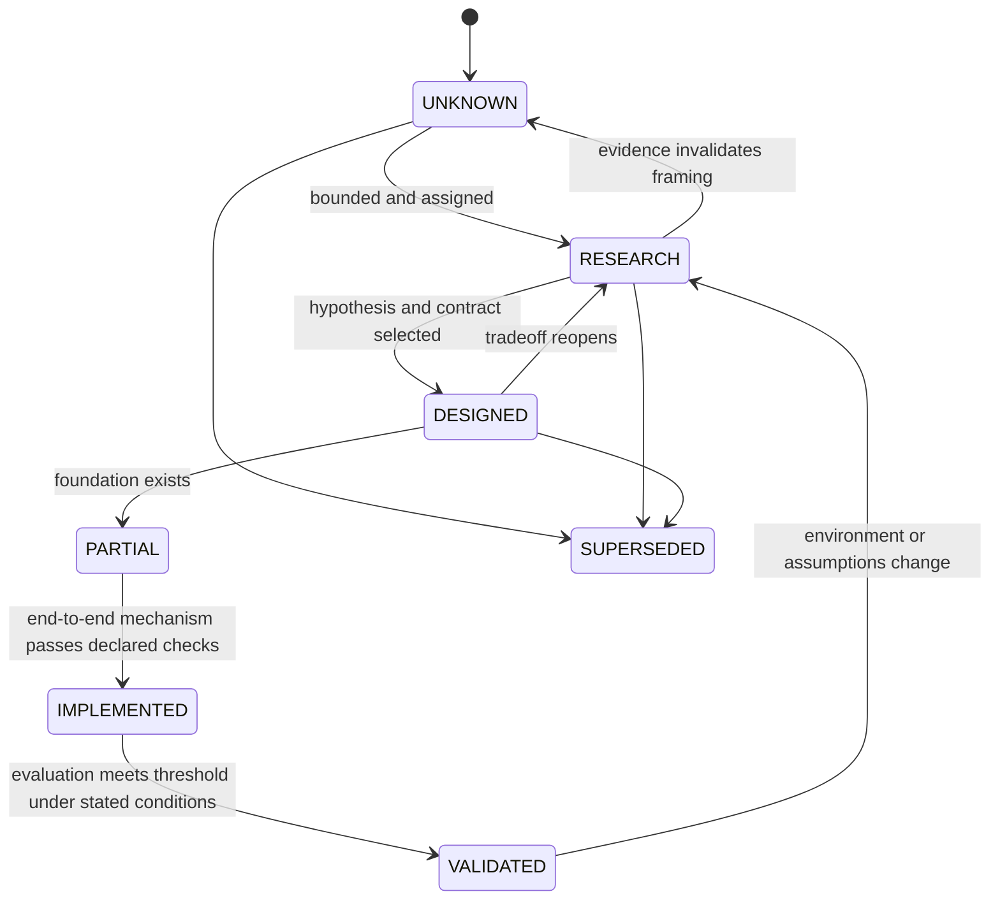

# Research Method

## Question record

Every active research question should eventually contain:

```yaml
id: RQ-NNN
title: one bounded question
domain: research theme
status: UNKNOWN | RESEARCH | DESIGNED | PARTIAL | IMPLEMENTED | VALIDATED | SUPERSEDED
motivation: failure or decision this question affects
current_hypothesis: falsifiable candidate answer
alternatives: competing explanations or mechanisms
evidence: links to experiments, traces, literature, tests, or incidents
experiment:
  method: what will be varied and observed
  baseline: comparison point
  metrics: measurements and qualitative rubric
  success_threshold: declared before results are inspected
risks: safety, privacy, bias, or validity threats
dependencies: related RQs and ADRs
next_action: one concrete owner-ready step
last_reviewed: YYYY-MM-DD
```

## Status transitions



Status is scoped. `VALIDATED` must name the population, environment, task class, and constraints under which the evidence applies.

## Experiment levels

| Level | Purpose | Example evidence |
| --- | --- | --- |
| E0 — thought model | Expose assumptions and counterexamples | State machine, threat scenario, decision table |
| E1 — offline simulation | Test logic without real side effects | Generated conflicts, fault injection, replay corpus |
| E2 — sandbox integration | Exercise real interfaces with synthetic data | Contract and read-back tests |
| E3 — shadow operation | Compare decisions without acting | Policy disagreement and false-alert rates |
| E4 — approval-gated pilot | Observe bounded real outcomes | User approvals, overrides, verification results |
| E5 — limited delegation | Test preauthorized low-risk behavior | Incident-free runs under a strict envelope |

Progression is not automatic. Safety, privacy, and reversibility determine whether a higher level is appropriate.

## Evaluation discipline

- Write the expected result and threshold before running the experiment.
- Keep raw observations separate from model interpretation.
- Preserve negative and inconclusive results.
- Record model, prompt/policy, runtime, dataset, seed, revision, and environment where relevant.
- Measure false success, false failure, unknown-state handling, and calibration—not only average task success.
- Include human evaluation for interruption, continuity, trust, and correction cost.
- Test adversarial and degraded conditions, not only happy paths.
- Never use private user data when synthetic or consented data can answer the question.

## Decision linkage

A research result may inform an ADR, but it does not silently change architecture. Accepted decisions cite the evidence and state limitations. If new evidence reverses a conclusion, supersede the ADR without deleting its history.
